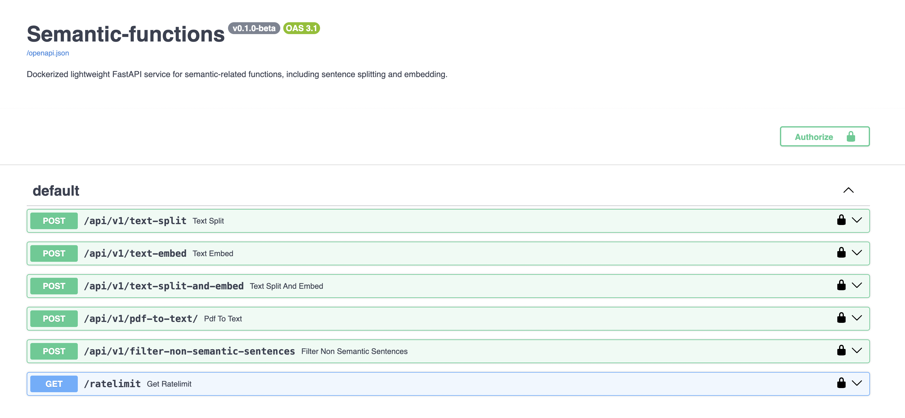

# 🌎 Semantic Functions

## Overview & Features

Semantic-functions is a dockerized lightweight FastAPI service for semantic-related functions, including sentence splitting and embedding. This solution allows you to serve semantic functions through an API with custom hourly and daily rate limits.

This application was based upon the structure from [ProxyGPT v0.1.0](https://github.com/Bklieger/ProxyGPT/releases/tag/v0.1.0). The sentence-transformers model used is [Multilingual-Text-Semantic-Search-Siamese-BERT-V1](https://huggingface.co/SeyedAli/Multilingual-Text-Semantic-Search-Siamese-BERT-V1).

See [Installation](#installation) to get started.

## Routes

/api/v1/text-split: Intelligently split body text into sentences.

/api/v1/text-embed: Provide embeddings for provided sentences.

/api/v1/text-split-and-embed: Provide embeddings for each sentence from provided text.

/api/v1/pdf-to-text: Convert PDF to text.

/api/v1/filter-non-semantic-sentences: Filter non-semantic sentences.

/api/v1/semantic-search: Run semantic search with sentences and embeddings.

/ratelimit: Show rate limits.

## Installation

1. First, download the repository.
2. Next, configure the settings in settings.py.

    USE_HOURLY_RATE_LIMIT (bool)
   
    USE_DAILY_RATE_LIMIT (bool)
   
    INSECURE_DEBUG (bool)
   
Note that both rate limits can be active and enforced simultaneously.

4. Set the environment variables in .env. See [Environment Variables](#environment-variables).
5. Run with or without Docker. See [Running with Docker](#running-with-docker) and [Running without Docker](#running-without-docker).

## Customization

You can easily modify the API endpoints in main.py.

## Details

This project was developed with the goal of creating a simple and lightweight API enabling intelligent splitting of a body of text into a list of sentences, and embedding of text using an open source model specifically designed for semantic search.

Rate limits, hourly and daily, are not tied to calendar hours or days. Instead, they operate on rolling windows of time, specifically the last 3600 seconds for hourly limits, and 86400 seconds for daily limits. Thus, usage counts do not reset at the beginning of a new day or hour, but are only no longer counted once they are greater than one hour or one day from the current time.

In addition, you can use both hourly and daily rate limits together, just one of the two, or none. They are seperate checks, and if either are active and the usage exceeds them, the call to Semantic-functions will be returned with status code 429 (Too Many Requests).

You can view the enabled rate limits and current usage from the /ratelimit endpoint. Use /docs or /redoc to explore all the endpoints by Semantic-functions.

Finally, it should be noted that any errors that arise in the code may be passed directly to the API client for easy debugging. However, this increases the risk of leaking any sensitive information stored on the server side. You can turn this off by changing INSECURE_DEBUG to False in settings.py for a production release.

## Environment variables

Required:

SEMFUN_API_KEY = str: Your strong custom API key for the service

Optional:

If using hourly rate limit (from settings):

   SEMFUN_HOURLY_RATE_LIMIT = int: max amount of calls allowed within a rolling one hour window

If using daily rate limit (from settings):

   SEMFUN_DAILY_RATE_LIMIT = int: max amount of calls allowed within a rolling one day window

## Running with Docker

### To build the docker image
~~~
docker build -f Dockerfile -t semfun:latest .
~~~

### Run docker image in same directory as env file
~~~
docker run --env-file .env -p 8000:8000 semfun:latest
~~~
Set environment variables in .env first. Run with -d for detached.

Semantic-functions app is now online, and can be accessed at http://127.0.0.1:8000. Visit http://127.0.0.1:8000/docs to explore the auto-generated documentation.

## Running without Docker

### To create virtual env
~~~
python -m venv venv
~~~

### To activate virtual env
~~~
source venv/bin/activate
~~~

### To install libraries
~~~
pip install -r requirements.txt
~~~

### To install punkt
~~~
python -m nltk.downloader punkt
~~~

### To install semantic model
~~~
python download_semantic_model.py
~~~

### Set environment variables
~~~
touch .env
~~~
Add the variables to the .env file. See example.env and [Environment Variables](#environment-variables).
~~~
export $(cat .env | xargs)
~~~

### Run with uvicorn

~~~
uvicorn main:app --reload
~~~

### Run with gunicorn (alternative for production environment)

~~~
gunicorn -w 4 -k uvicorn.workers.UvicornWorker main:app -b 0.0.0.0:8000
~~~

Semantic-functions app is now online, and can be accessed at http://127.0.0.1:8000. Visit http://127.0.0.1:8000/docs to explore the auto-generated documentation.

## Changelog

v0.1.0-beta:
- Initialized Project for Release

## Future Features

